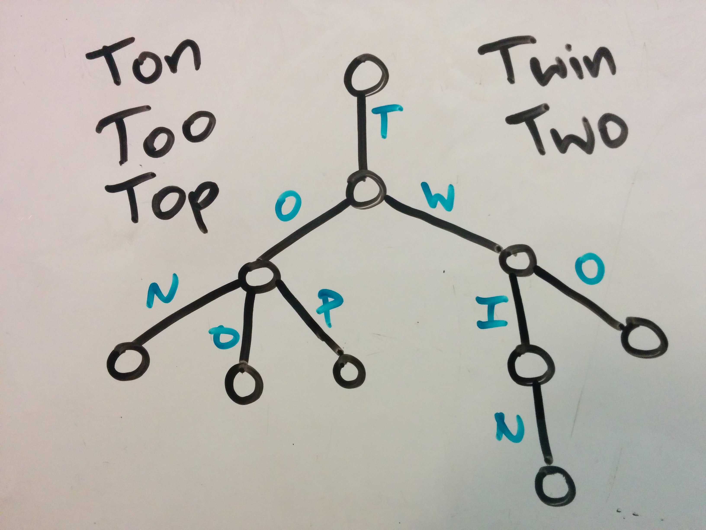

<!--
Creator: Team, editing by Cory
Market: SF
-->

# Trees

### Why is this important?
<!-- framing the "why" in big-picture/real world examples -->
*This workshop is important because:*

...

### What are the objectives?
<!-- specific/measurable goal for students to achieve -->
*After this workshop, developers will be able to:*

- 
-
-

### Where should we be now?
<!-- call out the skills that are prerequisites -->
*Before this workshop, developers should already be able to:*

-
-
-

## Introduction/Quick Reference  (10 minutes)

**Graph**

* stores data in vertices (nodes)
* vertices connected by edges that signify relationships or transitions
* edges can be undirected (two-way) or directed (one-way)

**Tree**

* type of graph
* rooted
* edges/branches all directed (one-way), away from the root
* acyclic (doesn't allow cycles or circular paths)
* each node can have only one parent / only one branch leading into it

**Binary Search Tree (very common in interviews)**

* stores data in a sorted order (keys have to be sortable)
* max number of children per node: 2
* left subtree of any node has all keys less than or equal to the node's key
* right subtree of any node has all keys greater than or equal to the node's key
* height with `n` nodes:
	if balanced, `O(log(n))`
	if not balanced, `O(n)`
* each node has a key and usually some extra associated data we care about

**Trie**

* kind of tree
* stores sequential data
* each branch adds to the sequence
* nodes that are the end of a word or sequence are marked as such
* height not determined by number of nodes

### Today's Challenges

Today's challenges are set up more like what you might encounter in an actual coding interview. We expect you to work in teams of 2 or 3 and do each problem on the whiteboard or the table.  We'll have a very limited time to work on each problem in class, and we'll go over the problems after.  Please do not look at the solutions or look up solutions to these problems online during the drills this morning.

## Challenges

PLEASE DO NOT CODE UNLESS A CHALLENGE SPECIFICALLY INSTRUCTS YOU TO

### Base Challenges (5 minutes)

Do as many of these challenges as you can in 5 minutes. Don't worry if you don't finish them all.

1. By hand on the whiteboard, create a binary search tree from the following array: [0,1,2,3,4,5,6].

1. Create a trie for the following word list: ["hey", "hi"].

1. How would you add the phrase "hello, govnuh" to your trie from above?

1. What determines the height of a trie?  

1. Can you think of a way to modify your trie from above to store the same data with a shorter tree?

1. A "min heap" is another abstract data structure often thought of as a type of binary tree. It has a few additional restrictions, including one called the "min heap property:" every node's key is less than the keys of its children. What is special about the root of a min heap?  

## Binary Search Tree (15 minutes)

**Get as far in this challenge as you can in 15 minutes.**

Assume for the following challenges that you have a binary search tree data structure. The structure will be recursive, meaning each node is actually represented as a full subtree, an instance of `BinarySearchTree`.

The constructor for a `BinarySearchTree` instance requires that you specify the key for the current node, and it sets the left and right subtrees/nodes to  `None` (or `nil` or `null` depending on what programming language you're using; the "pseudocode" solutions use `None`).

The data structure allows you to do the following:

* given a tree called `my_bst`, access the "root node" with `my_bst`
* given any node, find the left child node/subtree of that node with `.left`
* given any node, find the right child node/subtree of that node with `.right`
* given any node, find its key with `.key`

1. You run a website where users can assign creative names to colors. You store named colors as nodes in a self-balancing binary search tree, where the key of a node is the hex code of its color (for example: `#30af99`, `#c0ffee`). Users shouldn't be able to change the name of a color.  Pseudocode a `has_key` function to check if a particular hex value is already in the tree.  If the key is in the tree, your function should return `true`. If the key is not in the tree, your function should return `false`. Your function should take the tree and the hex color key as arguments.

	Stretch Version: Pseudocode an `insert_if_free` function to check if the color exists *and* insert it if it's not already in the tree. If the key is not in the tree, your function should add it to the tree and return `true` (notice this is the reverse of what `has_key` returns).  If the key is already in the tree, your function should return `false`. Your function should take the tree as one argument and the information about the new color as one or more other arguments.  Don't worry about maintaining the balance of the tree; just insert the new node at any valid location.

1. You follow a favorite literary critic's book ratings very closely.  In particular, you keep a self-balancing binary search tree of all the critic's reviews, where each node's key is the rating given by the critic to that node's book.  Every time the critic publishes a new book review, you add it to the tree. Every time you finish reading your current book, you read the next highest-rated book. As a first step to automating your book selection process, pseudocode a `max` function to find the book in the tree with the highest rating. Your function should take the tree as its argument. (A next step would be to also delete the item, but don't work on that right now.)

## Trie (15 minutes)

**Get as far in this challenge as you can in 15 minutes.**

Assume you have a `Trie` data structure.   The constructor for a `Trie` instance requires that you specify the value/symbol of the branch leading into the new node, and it sets `children` list of the node to an empty array. If the new node is to be the root of a Trie, its key should be `"root"` as a special start signal. (This is not a convention, just a choice made by whoever designed this trie.)

The data structure allows you to do the following:

* given a tree called `my_trie`, access the "root node" with `my_trie`
* given any node, find an array containing all its children with `.children`
* given any node, find the symbol on the branch leading into it with `.symbol`.

1. Your site has a list of options users can choose for frozen yogurt flavor. You've already converted the list to a trie, but now the frozen yogurt vendor wants to be able to add new flavors. Describe an algorithm to insert a new flavor into the trie. It should not add the flavor again if it's already in the trie.

### Tree

Assume for the following challenge that you have a recursive tree data structure.

The constructor for a `Tree` instance requires that you specify the key for the current node, and it sets `children` list of the node to an empty array.

The data structure allows you to do the following:

* given a tree called `my_tree`, access the "root node" with `my_tree`
* given any node, find an array containing all its children with `.children`
* given any node, find its key with `.key`

In addition, as a special bonus not always available in trees, you can:   
* given any node, find its parent node with `.parent` (the parent of the root node is `None`)

1. Given the names of two people in a military group, and a tree that represents the military heirarchy, your task is to find the lowest-rank person who commands both of the other people (this excludes the people themselves). If there is no such person, return `None`.  This is often called a  `lowest_common_ancestor` function.

# Reference

Some notes on graphs and trees, including terminology.

## Graphs

In computer science, graphs are collections of **vertices** or **nodes**, which usually store or represent some data, and **edges**, which connect the nodes. Each edge connects two nodes together.  If you think of nodes as airports, edges would be the flight paths between them.  Here are some use cases for graphs:

* graph databases
* relationships among users in a social network
* links between pages on a website
* finding a route between two locations
* planning the order of classes to take based on prerequisites

A sequence of edges is called a "path".

<!---->

## Trees

Trees are a special kind of graph with some extra rules about their nodes and edges. First, every tree has a unique, special start node called the "root" node.
(We usually draw trees vertically with the "root" node at the top of the tree.)Second, each node in a tree can only ever have one "parent". This means there's only ever one direct path from any node to the root of the tree.  One classic example of a tree is a file sytem, where directories contain other directories and/or files. The `/` directory is called the "root" directory because it's literally the root of the computer's directory tree.  Here are a few other example use cases of trees:

* **the DOM tree**
* comment trees (where users can comment on comments)
* data compression algoritm trees (Huffman coding)
* single-elimination tournaments
* parser trees or syntax trees that help a computer interpret human-readable code
* the way calculators compute order of operations

The edges in a tree are sometimes referred to as "branches".  Nodes of the tree that do not have any children are called "leaves" because no branches lead away from them. The length of the longest path from the root to a leaf is called the tree's "height".

Tree data structures adopt language from family trees. If an edge in a tree connects two nodes, the one closer to the root is the "parent", and the other is a "child".  From the perspective of a single node, some other nodes will be on the path between that node and the root. These are the node's "ancestors." Other nodes might be children of the  node, or children of the node's children. These are called the node's "descendants."  Nodes that share the same "parent" can be called "siblings," but that's rarer.

## Trees to Know for the Job Search

### Balanced Binary Search Trees

Balanced Binary Search Trees (balanced BSTs) are trees, binary trees, binary search trees, and balanced trees.  

#### Binary Trees

The most common types of trees for interviews are "binary trees," which allow each node to have up to 2 children. We say each node can have a "left child" and a "right child."  The left child can be considered the root of a "left subtree", and the right child can be considered the root of a "right subtree".

#### Binary Search Trees

Binary search trees add on an extra restriction to binary trees. In each node's left child subtree (if it has one), all nodes will will have keys *less* than the original node's key.  In each node's right child subtree (if it has one), all nodes must have a **greater** key than the original node itself. Left is less!

#### Balanced Trees

Balanced trees are another basic variant of trees. A "balanced" tree has a height about as low as it can possibly be while still holding all its nodes.  There are different definitions of exactly how to balance a tree, but you can tell a tree is balanced if all of the "missing children" (areas where another node could be attached but isn't) are either at the very bottom level of the tree or just one level higher. For binary trees, being balanced means the height is `O(log``2``(n))` (or just `O(log(n))`), where `n` is the number of nodes in the tree.  

#### And finally... Balanced Binary Search Trees

Balanced binary search trees combine the balanced structure requirement with the node key requirement of binary search trees.  If an interview question asks about a tree, it's probably a balanced binary search tree. Ask your interview to clarify, though, whether the tree is balanced and whether it is a binary search tree.

#### Why Are Binary Search Trees Even a Thing?

Below you'll find a table of speeds of common operations for a few of the data structures we've seen: unsorted arrays, sorted arrays, hashes, and binary search trees. The big O notation in the table shows the amortized worst case run time. You may not have a lot of context for big O yet, so before we jump into the main table here's an example.

Twitter handles hundreds of millions of tweets each day.  (Computers can halde about a billion operations per second, but an algorithm usually requries more than one operation to handle each input.)  If Twitter has an <i>O</i>(<i>n</i>) algorithm that somehow processes all these tweets in about 40 seconds, changing to an <i>O</i>(log&nbsp;<i>n</i>) algorithm could reduce that time to just over 5 seconds (that kind of savings adds up!). An <i>O</i>(<i>n</i>&nbsp;log&nbsp;<i>n</i>) algorithm might take about 3.5 minutes.

<table>
<tbody>
<tr>
	<th></th>
	<th>Insert</th>
	<th>Delete</th>
	<th>Get ith by index</th>
	<th>Select kth in order of value</th>
	<th>Search</th>
	<th>Find minimum</th>
	<th>Find maximum</th>
</tr>
<tr>
	<td>Unsorted array</td>
	<td><i>O</i>(<i>n</i>)*</td>
	<td><i>O</i>(<i>n</i>)*</td>
	<td><a href="/wiki/Constant_time" title="Constant time" class="mw-redirect"><i>O</i>(1)</a></td>
	<td><i>O</i>(<i>n</i>&nbsp;log&nbsp;<i>n</i>)**</td>
	<td><i>O</i>(<i>n</i>)</td>
	<td><i>O</i>(<i>n</i>)</td>
	<td><i>O</i>(<i>n</i>)</td>
</tr>											
<tr>
	<td>Sorted array</td>
	<td><i>O</i>(<i>n</i>)</td>
	<td><i>O</i>(<i>n</i>)</td>
	<td><i>O</i>(1)</td>
	<td><i>O</i>(1)</td>
	<td><i>O</i>(log&nbsp;<i>n</i>)</td>
	<td><i>O</i>(1)</td>
	<td><i>O</i>(1)</td>
</tr>
<tr>
	<td>Hash</td>
	<td><i>O</i>(1)</td>
	<td><i>O</i>(1)</td>
	<td>N/A</td>
	<td><i>O</i>(<i>n</i>)</td>
	<td><i>O</i>(1)</td>
	<td><i>O</i>(<i>n</i>)</td>
	<td><i>O</i>(<i>n</i>)</td>
</tr>
<tr>
	<td>Binary Search Tree+</td>
	<td><i>O</i>(<i>height</i>)</td>
	<td><i>O</i>(<i>height</i>)</td>
	<td>N/A</td>
	<td><i>O</i>(<i>n</i>)++</td>
	<td><i>O</i>(<i>height</i>)</td>
	<td><i>O</i>(<i>height</i>)</td>
	<td><i>O</i>(<i>height</i>)</td>
</tr>
</tbody></table>

\* Insertion or deletion at the end of an array is <i>O</i>(1)  (constant time).    
\*\*  Sort and then binary search. A faster <i>O</i>(<i>n</i> + <i>k</i>&nbsp;log&nbsp;<i>n</i>) algorithm exists using the heap data structure, which we haven't talked about yet.  There are also faster sorts if you have information about your input.   
+ For a <a href="/wiki/Self-balancing_binary_search_tree" title="Self-balancing binary search tree" class="mw-redirect">Self-balancing binary search tree</a>, the height is <i>O</i>(log&nbsp;<i>n</i>). If the tree is not balanced, the height can be up to <i>O</i>(<i>n</i>).   
++ Can reduce to <i>O</i>(<i>height</i>) by augmenting each node to keep track of the size of its subtree.   

### N-ary or K-ary Trees

N-ary trees don't have to be binary; their nodes can have more than two children. These are also known as "just regular trees" and have the characteristics defined for all trees above.

### Tries

Tries, also called prefix trees, store data differently than other trees we'll look at. The data is only stored in the leaves, and it builds up over the path from the root to each leaf.   Here's an example:

Usually the end of each word in a trie will be marked, or there will be special end of word nodes that signify the end of a word.

Specialized tries that store data in binary format (as sequences of 0s and 1s) are used by most hardware routers to send data across the internet. They allow for fast lookup within their limited set of stored sequences, so they're often used with words (sequences of letters!) for autocomplete, spell checking, or other string matching scenarios.

## Tree Strategies for Interviews

* Make sure you know whether a tree you're given is binary, self-balancing, a binary search tree. Or, if you're using a tree, clarify which of these properties you want it to have.   
* Be clear about what each node's key is and what other data is stored in the node.   
* Consider storing extra data about the tree inside each node. For example, if you need to find the kth heighest value in a binary search tree, a classic way to go about it is to have each node store the size of its subtree.

## Vocab Practice

1. Use the diagram below to fill in the following table:

	| Node  | parent | left child | right child |
	| :---- | :-- | :-- | :-- |
	| A |  |   |  |
	| B |  |  |  |
	| C |  |   |   |

  

1. In the same diagram (above), which node is the root?  Which are leaves?

1. Finally, in that same diagram, what is the height of the tree?

    

1. Which of the following is a tree? (There may be more than one.)

  

1. Which of the following is a balanced tree? (There may be more than one.)

  

1. Which of the following is a binary search tree? (There may be more than one.)

  

## Vocab Practice **Solutions**

1. Use the diagram below to fill in the following table:

	| Node  | parent | left child | right child |
	| :---- | :-- | :-- | :-- |
	| A | *B* | *none*  | *none*  |
	| B | *D* | *A* | *C* |
	| C | *B* |  *none* |  *none* |

  

1. In the same diagram (above), which node is the root?  Which are leaves?

  *D is the root.  A, C, and E are leaves.*

1. Finally, in that same diagram, what is the height of the tree?

  *The height is 2, because the longest path from root to leaf has 2 edges/branches in it.*
    

1. Which of the following is a tree? (There may be more than one.)

  

  *B, D, E are trees.*

  *A is not a tree because one node has 2 parents.*

  *C is not a tree because there is a cycle (a circular path from one node back to that same node).*

  *F is not a tree because it's 2 trees! This is called a "forest".*

1. Which of the following is a balanced tree? (There may be more than one.)

  

  *B, D, and C are balanced because all of the "missing children" in these trees are either at the bottom level or one level above.*

1. Which of the following is a binary search tree? (There may be more than one.)

  

  *Only the tree rooted with 6 is a binary search tree. The others both have nodes in the root's left subtree that are greater than the root node.*
